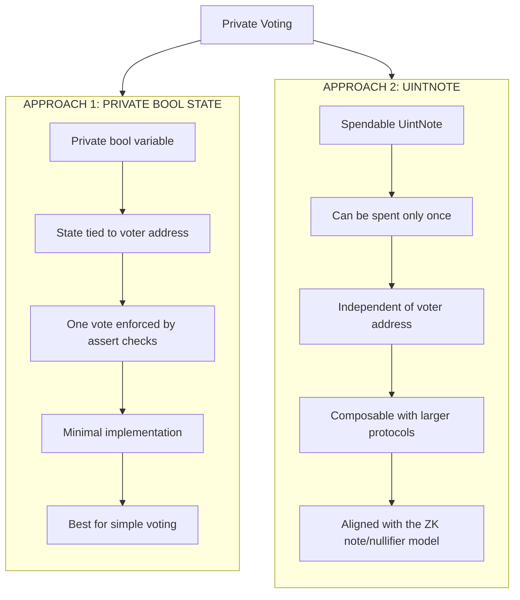

# aztec_simple_voting
An educational project explores two different implementations of private on-chain voting, comparing their design, security  and scalability.

## Private Voting Implementations

